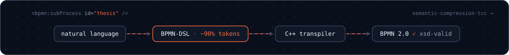
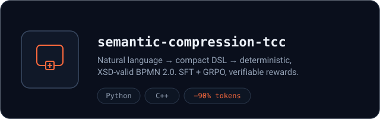
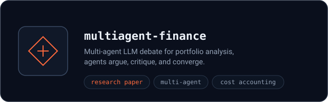
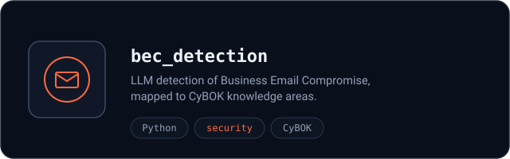
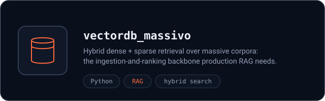

  

  
  
  

  LLM systems, data platforms, and automation that keep working after the demo. 
  Thesis: compiling natural language into processes, because prayer is not a compiler strategy.

<table>
  <tr>
    <td width="50%">
      
    </td>
    <td width="50%">
      
    </td>
  </tr>
  <tr>
    <td width="50%">
      
    </td>
    <td width="50%">
      
    </td>
  </tr>
</table>

  <code>Python</code> · <code>Rust</code> · <code>C++</code> · <code>pydantic-ai</code> · <code>LangGraph</code> · <code>Qdrant</code> · <code>ClickHouse</code> · <code>Airflow</code> · <code>dbt</code> · <code>PostgreSQL</code> · <code>Docker</code> · <code>AWS</code> · <code>GCP</code>

<code>&lt;/bpmn:definitions&gt;</code>

